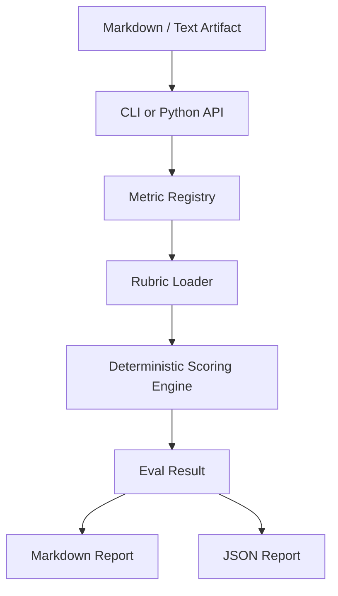
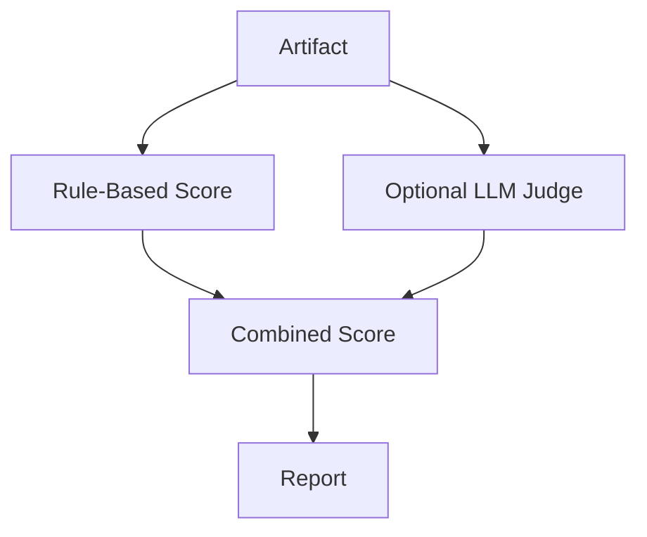

# Architecture

## System overview



## Components

### CLI

The CLI accepts an input file and metric name.

```bash
python -m pmeval.cli run --metric prd_quality --input examples/sample_prd.md
```

### Registry

The registry maps metric names to evaluator classes.

### Rubric loader

Each metric has a JSON rubric defining:

- dimensions
- keywords
- required sections
- recommendations
- score weights

### Scoring engine

The v0.1 scoring engine is deterministic:

- keyword coverage
- section coverage
- artifact length sanity checks
- required concept detection
- recommendation generation

### Future LLM judge adapter

v0.2 can add an optional LLM-as-judge adapter for deeper semantic scoring.


